# 🚀 Basic gRPC Service in Elixir

<div align="center">


[](https://opensource.org/licenses/MIT)
[](https://elixir-lang.org/)
[](https://github.com/grpc/grpc/blob/master/doc/health-checking.md)
[](https://github.com/grpc/grpc/blob/master/doc/server-reflection.md)
[](https://github.com/FiloSottile/mkcert)
[](https://buf.build)

*A delightful demonstration of gRPC services in Elixir, featuring ELIZA, the classic psychotherapist chatbot from the 1960s! 🤖*

</div>

## 🌟 What's This All About?

Ever wanted to build a gRPC service in Elixir? Ever wanted to chat with ELIZA? Ever wanted to do both at the same time? Well, you're in luck! This project showcases a production-ready gRPC service implementation in Elixir with some seriously cool features:

- **💬 Talk to ELIZA**: The legendary chatbot from MIT, now available via gRPC streaming!
- **☁️ CloudEvents Integration**: All responses wrapped in standardized CloudEvents format
- **🔍 Full Server Reflection**: Explore the API with tools like `grpcurl` or Postman
- **💚 Health Checking**: Built-in health check service following gRPC standards
- **⚡ Background Processing**: Fan-out/fan-in pattern demonstration with concurrent task execution
- **🎯 Google.Protobuf.Any Support**: Dynamic message handling with proper type URLs
- **🔒 HTTPS/TLS Support**: Secure communication with locally trusted certificates
- **🛠️ Buf CLI Integration**: Modern protobuf workflow with linting and breaking change detection

## 🎮 Quick Start

### Prerequisites

- Elixir ~> 1.17
- Protocol Buffer compiler (`protoc`) [:link:](https://github.com/protocolbuffers/protobuf#protocol-compiler-installation)
- `protoc` plugin for Elixir (`protoc-gen-elixir`) [:link:](https://github.com/elixir-protobuf/protobuf)
- `mkcert` for local TLS certificates [:link:](https://github.com/FiloSottile/mkcert)
- Your favorite gRPC client (grpcurl, Postman, etc.)

### Installation

```bash
# Clone this repository
git clone https://github.com/yourusername/basic_grpc_service
cd basic_grpc_service

# Install dependencies
mix deps.get

# Compile the project
mix compile
```

### 🔐 Generate TLS Certificates (Required)

The gRPC server runs with HTTPS/TLS enabled for secure communication. You need to generate local certificates before starting the server:

```bash
# Install mkcert if you haven't already
brew install mkcert  # macOS
# or for Linux: https://github.com/FiloSottile/mkcert#installation

# Install local CA (only needed once per machine)
mkcert -install

# Create the certs directory
mkdir -p priv/certs

# Generate certificates for localhost
cd priv/certs
mkcert -cert-file local.crt -key-file local.key localhost 127.0.0.1 ::1

# Return to project root
cd ../..
```

Your certificate structure should look like:

```
priv/
└── certs/
    ├── local.crt  # The certificate file
    └── local.key  # The private key file
```

⚠️ **Important**: The `priv/certs` directory is gitignored for security. Never commit certificates to version control!

### Starting the Server

```bash
# Start the server with TLS enabled
mix run --no-halt
```

Your secure gRPC server is now running on `https://127.0.0.1:9443`! 🎉

## 🛠️ Development

### Protocol Buffer Management with Buf

This project uses [Buf CLI](https://buf.build) for modern protobuf workflow management. Buf provides:

- **Linting**: Ensures your `.proto` files follow best practices
- **Breaking Change Detection**: Catches backwards-incompatible changes
- **Code Generation**: Streamlined generation of Elixir code from protos

#### Buf Configuration

The project includes two Buf configuration files:

**`buf.yaml`** - Defines the protobuf module and lint/breaking rules:
```yaml
version: v2
modules:
  - path: ./priv/proto
    lint:
      use:
        - STANDARD
    breaking:
      use:
        - FILE
        - WIRE_JSON
```

**`buf.gen.yaml`** - Configures code generation:
```yaml
version: v2
plugins:
  - local: protoc-gen-elixir
    out: lib/sdk
    opt:
      - plugins=grpc
      - gen_descriptors=true
```

#### Working with Protobuf Files

```bash
# Lint your proto files
buf lint

# Check for breaking changes (requires git history)
buf breaking --against '.git#branch=main'

# Generate Elixir code from proto files
buf generate

# Format proto files
buf format -w

# View your API documentation
buf build
```

#### Adding New Proto Files

1. Add your `.proto` file to `priv/proto/`
2. Run linting to ensure it follows standards:
   ```bash
   buf lint
   ```
3. Generate the Elixir code:
   ```bash
   buf generate
   ```
4. The generated code will appear in `lib/sdk/`
5. Implement your service in `lib/` using the generated modules

## 🛠️ Features & Services

### 1. BasicService

The main service with three awesome RPCs:

#### `Hello` - Simple Unary RPC
Say hello and get a CloudEvent-wrapped greeting back!

```bash
# Note: Using -plaintext flag will NOT work with TLS enabled
# For local development with self-signed certs, use -insecure
grpcurl -d '{"message": "World"}' 127.0.0.1:9443 basic.v1.BasicService/Hello
```

#### `Talk` - Bidirectional Streaming with ELIZA
Have a therapeutic conversation with the classic ELIZA chatbot!

```bash
grpcurl -d @ 127.0.0.1:9443 basic.v1.BasicService/Talk <<EOM
{"message": "Hello ELIZA"}
{"message": "I feel happy today"}
{"message": "My mother always said I should code more"}
{"message": "Goodbye"}
EOM
```

ELIZA will respond with her characteristic Rogerian psychotherapy style:

- "How does that make you feel?"
- "Tell me more about your mother."
- "Why do you think you feel happy today?"

#### `Background` - Server Streaming
Launch background tasks and receive status updates!

```bash
grpcurl -d '{"processes": 5}' 127.0.0.1:9443 basic.v1.BasicService/Background
```

### 2. Health Service

Monitor your service health like a pro:

```bash
# Check overall health
grpcurl 127.0.0.1:9443 grpc.health.v1.Health/Check

# Check specific service health
grpcurl -d '{"service": "basic.v1.BasicService"}' \
  127.0.0.1:9443 grpc.health.v1.Health/Check

# List all services and their statuses
grpcurl 127.0.0.1:9443 grpc.health.v1.Health/List
```

### 3. Server Reflection

Discover the API dynamically:

```bash
# List all services
grpcurl 127.0.0.1:9443 list

# Describe a service
grpcurl 127.0.0.1:9443 describe basic.v1.BasicService

# Describe a message type
grpcurl 127.0.0.1:9443 describe basic.service.v1.HelloRequest
```

## 🏗️ Architecture

```mermaid
%%{init: {'theme': 'dark'}}%%
graph TB
    Client[/"👤 gRPC Client<br/>(grpcurl, Postman, etc.)"/]

    Client -->|"HTTPS/TLS<br/>Port: 9443"| Endpoint

    subgraph Server["🖥️ Elixir gRPC Server"]
        Endpoint["🔒 gRPC Endpoint<br/>TLS/SSL Termination"]

        Endpoint --> Logger["📝 Interceptor: Logger"]

        Logger --> Services{" "}

        Services --> BasicService["📦 Basic Service<br/>• Hello<br/>• Talk<br/>• Background"]
        Services --> HealthService["💚 Health Server<br/>• Check<br/>• List<br/>• Watch"]
        Services --> ReflectionV1["🔍 Reflection v1<br/>Server Discovery"]
        Services --> ReflectionV1Alpha["🔍 Reflection v1alpha<br/>Server Discovery"]

        BasicService --> Protobuf["📋 Protocol Buffers<br/>(Generated via Buf CLI)"]
        HealthService --> Protobuf
        ReflectionV1 --> Protobuf
        ReflectionV1Alpha --> Protobuf

        Protobuf --> BusinessLogic["💼 Business Logic"]

        BusinessLogic --> Eliza["🤖 ELIZA<br/>Chatbot Engine"]
        BusinessLogic --> Utils["🛠️ Utils<br/>• CloudEvents<br/>• State Management<br/>• Helpers"]
    end

    ProtoFiles["📄 Proto Definitions<br/>priv/proto/"]
    BufCLI["🛠️ Buf CLI"]

    ProtoFiles -->|"buf generate"| BufCLI
    BufCLI -->|"Generated Code"| Protobuf
```



## 📁 Project Structure

```
basic_grpc_service/
├── lib/
│   ├── sdk/                    # Generated protobuf code
│   │   ├── basic/              # Service messages
│   │   ├── grpc/health/        # Health check protos
│   │   └── io/cloudevents/     # CloudEvents format
│   ├── grpc/                   # gRPC implementations
│   │   ├── health/server.ex    # Health check service
│   │   └── reflection/server.ex # Reflection API
│   ├── eliza.ex                # ELIZA chatbot implementation
│   ├── server.ex               # Main gRPC server
│   ├── endpoint.ex             # gRPC endpoint configuration
│   ├── utils.ex                # Utilities & helpers
│   └── application.ex          # OTP application
├── priv/
│   ├── proto/                  # Protocol buffer definitions
│   │   ├── basic/v1/           # Service definitions
│   │   ├── grpc/health/v1/     # Health proto
│   │   └── io/cloudevents/v1/  # CloudEvents proto
│   └── certs/                  # TLS certificates (gitignored)
│       ├── local.crt           # Server certificate
│       └── local.key           # Private key
└── mix.exs                     # Project configuration
```

## 🧪 Testing the Services

### Using grpcurl with TLS

```bash
# Install grpcurl if you haven't already
brew install grpcurl  # macOS
# or download from https://github.com/fullstorydev/grpcurl

# Test Hello (note the -insecure flag for local certs)
grpcurl -d '{"message": "Elixir"}' \
  127.0.0.1:9443 basic.v1.BasicService/Hello

# Have a chat with ELIZA
echo '{"message": "I feel anxious about my code"}' | \
  grpcurl -d @ 127.0.0.1:9443 basic.v1.BasicService/Talk
```

### Using Postman

1. Create a new gRPC request
2. Enter server URL: `127.0.0.1:9443`
3. In settings, enable "Enable TLS"
4. Disable certificate verification for local development
5. Use server reflection to import the service definition
6. Select your RPC and send requests!

## 🤖 About ELIZA

ELIZA is a historic piece of computing history! Created by Joseph Weizenbaum at MIT between 1964-1966, ELIZA was one of the first programs capable of attempting the Turing Test. Our implementation includes:

- Pattern matching for various conversation topics
- Pronoun reflection (I → you, my → your)
- Rogerian psychotherapy responses
- Support for emotions, family, dreams, and more
- Graceful conversation endings

Fun fact: ELIZA was so convincing that Weizenbaum's secretary asked him to leave the room so she could have a private conversation with it! 🎭

## 🚀 Advanced Features

### CloudEvents Integration

All responses from the BasicService are wrapped in CloudEvents format:

```json
{
  "id": "uuid-here",
  "source": "basic.v1.BasicService/Hello",
  "specVersion": "1.0",
  "type": "basic.v1.HelloResponseEvent",
  "dataContentType": "application/protobuf",
  "protoData": {
    "@type": "type.googleapis.com/...",
    "@value": "base64-encoded-protobuf"
  }
}
```

### Google.Protobuf.Any Handling

The service properly handles `Any` types with:

- Correct type URL formatting
- Binary encoding of nested messages
- Base64 representation in JSON

📝 Configuration

The service configuration can be modified in:

- `config/config.exs` - General configuration including TLS settings
- `lib/endpoint.ex` - gRPC endpoint setup
- `buf.yaml` - Protobuf linting and breaking change rules
- `buf.gen.yaml` - Code generation settings
- Port configuration: Default is `50051` (HTTPS)
- TLS certificates: `priv/certs/local.crt` and `priv/certs/local.key

### TLS/SSL Configuration

The server expects TLS certificates at:

- Certificate: `priv/certs/local.crt`
- Private Key: `priv/certs/local.key`

You can modify the certificate paths in your configuration if needed.

🤝 Contributing

Feel free to open issues and pull requests! Whether it's adding new ELIZA responses, improving the gRPC implementation, or adding new features, all contributions are welcome.

When modifying proto files:
1. Make your changes in `priv/proto/`
2. Run `buf lint` to ensure compliance
3. Run `buf breaking --against '.git#branch=main'` to check for breaking changes
4. Generate code with `buf generate`
5. Implement any new services in `lib/

## 📜 License

This project is licensed under the MIT License - see the [LICENSE](LICENSE) file for details.

---

<div align="center">

**Built with 💜 by Carsten Vuellings**

*Bringing the 1960s into the 2020s, one RPC at a time!*

[Report Bug](https://github.com/yourusername/basic_grpc_service/issues) • [Request Feature](https://github.com/yourusername/basic_grpc_service/issues)

</div>
